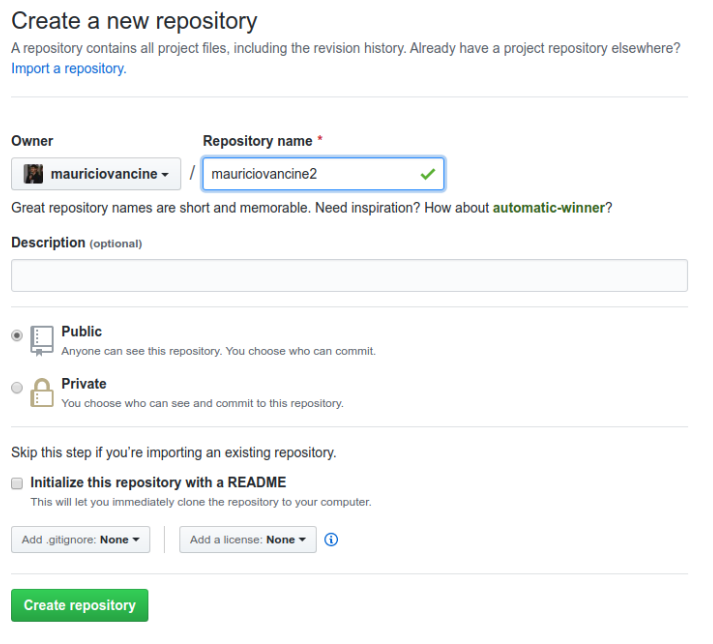

Que o [R](https://www.r-project.org/) tem múltiplas utilidades para análises e visualização de dados de diversos formatos e em [diversas áreas](https://data-flair.training/blogs/r-applications/) é indiscutível. Entretanto, a união dessa linguagem com o [Markdown](https://pt.wikipedia.org/wiki/Markdown), dando origem ao [RMarkdown](https://rmarkdown.rstudio.com/index.html), aliada ao IDE [RStudio](https://rstudio.com/products/rstudio/) ainda pode ser novidade para muitas pessoas. Essa junção permite diversas possibilidades de criação de [aplicações complementares ao R](https://bookdown.org/yihui/rmarkdown/). Pretendo escrever mais sobre essa união e utilidades num post futuro.

Nesse post, vou focar nos passos para a criação de um site acadêmico no R, uma forma bem interessante que achei de desafiar minhas habilidades e minha paciência...

Mais informações podem ser consultadas no site da [Profa. Alison Hill](https://alison.rbind.io/). Aliás, tentei deixar os passos que ela descreve nesses dois posts mais simples: [post 01](https://alison.rbind.io/post/2017-06-12-up-and-running-with-blogdown/) e [post 02](https://alison.rbind.io/post/2019-03-04-hugo-troubleshooting/). 

Também há o [post](https://diegopftrindade.netlify.com/2017/11/06/blogdown-tutorial-in-portuguese/) do Diego Trindade que tem uma descrição mais detalhada e uma discussão do porquê ter um site acadêmico.

## Passos para criação do site

### 1. Criar contas on-line
Primeiramente é necessário criar duas contas on-line: 
1. GitHub: https://github.com/ 
2. NetLify: https://www.netlify.com/

### 2. Criar um repositório no GitHub

Com a conta do GitHub feita, será necessário [criar um repositório](https://help.github.com/pt/github/getting-started-with-github/create-a-repo). Eu criei com o nome de "mauriciovancine2", só de exemplo, mas pode ser qualquer outro.

1. Criar um repositório no GitHub
NO README + NO .gitignore (ainda!)

2. clonar o repositório - git clone
File > New Project > Version Control > Git

3. RStudio: 
install.packages("blogdown")
library(blogdown)
new_site(theme = "gcushen/hugo-academic", 
         sample = TRUE, 
         theme_example = TRUE, 
         empty_dirs = TRUE,
         to_yaml = TRUE)

Conferir a versão do Hugo
https://themes.gohugo.io/academic/

is your version less than the minimum version?
hugo_version() 

if yes, then do this
update_hugo(force = TRUE)

4. Netlify
segure e arraste a pasta public/ para https://app.netlify.com/drop

5. criar um arquivo "netlify.toml"
file.create("netlify.toml")

Open, then copy & paste:

[build]
  publish = "public"
  command = "hugo"
[context.production.environment]
  HUGO_VERSION = "0.58.2"
  HUGO_ENV = "production"
  HUGO_ENABLEGITINFO = "true"
[context.branch-deploy.environment]
  HUGO_VERSION = "0.58.2"
[context.deploy-preview.environment]
  HUGO_VERSION = "0.58.2"

6. linkar o site com o GitHub no Netlify
